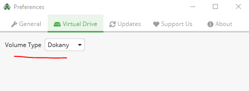

# Guide for encrypt data with Cryptomator
This is guide and test ground for storing any data in encrypted storage which can be shared through any cloud storage.

  https://cryptomator.org

  https://cryptomator.org/downloads/


## Installing in Windows

Quick version:
Download 'Cryptomator-X.X.X-x64.msi' and install it.

  https://cryptomator.org/downloads/

  https://cryptomator.org/downloads/win/thanks/

Here is batch script for downloading and installing Cryptomator.

```bat
C:

cd "%HOMEDRIVE%%HOMEPATH%\Downloads"

PowerShell -Command "& {$client = new-object System.Net.WebClient; $client.DownloadFile('https://github.com/cryptomator/cryptomator/releases/download/1.13.0/Cryptomator-1.13.0-x64.msi','.\Cryptomator-1.13.0-x64.msi')}"

:: Cryptomator-1.13.0-x64.msi
:: Cryptomator-1.13.0-x64.msi /?
Cryptomator-1.13.0-x64.msi /passive
```

<!---

### Install Dokany driver
NOTE: Cryptomator recommeds to download and install driver [Dokany](https://github.com/dokan-dev/dokany/releases)

  https://dokan-dev.github.io/

  https://github.com/dokan-dev/dokany/releases

  https://github.com/dokan-dev/dokany/releases/download/v1.5.1.1000/DokanSetup.exe


NOTE: Dokany version 2 is not yet supported by Cryptomator. So download version 1.

Read more about [Cryptomator issue](https://github.com/cryptomator/cryptomator/issues/2001)

Quick version:
Download 'DokanSetup.exe' and install it.

Here is batch script for downloading and installing Dokan.

```bat
C:

cd "%HOMEDRIVE%%HOMEPATH%\Downloads"

:: PowerShell -Command "& {$client = new-object System.Net.WebClient; $client.DownloadFile('https://github.com/dokan-dev/dokany/releases/download/v2.0.3.2000/DokanSetup.exe','.\DokanSetup-2.0.3.2000.exe')}"
PowerShell -Command "& {$client = new-object System.Net.WebClient; $client.DownloadFile('https://github.com/dokan-dev/dokany/releases/download/v1.5.1.1000/DokanSetup.exe','.\DokanSetup-1.5.1.1000.exe')}"

:: DokanSetup-2.0.3.2000.exe
:: DokanSetup-2.0.3.2000.exe /?
:: DokanSetup-2.0.3.2000.exe /passive
DokanSetup-1.5.1.1000.exe /passive
```

Make sure Dokany is selected as the volume type for Cryptomator.



--->


## Get Cryptomator test vault

Directory 'cryptomator-storage' in my Resilio Sync share is for testing purposes.
Install Resilio Sync by using my [guide](https://github.com/lordmikefin/resilio-sync-guide).
And sync 'c:\resilio-sync-test' directory by using my [read only key](https://github.com/lordmikefin/resilio-sync-guide/blob/main/sync/with-key.md).

## Open the test vault

 * Add vault
 * Open Existing Vault
 * Choose... -> C:\resilio-sync-test\cryptomator-storage\vault
 * Unlock now
 * Get password form my keepass database. Install keepass using my [guide](https://github.com/lordmikefin/keepass-guide)
 * Reveal Drive


